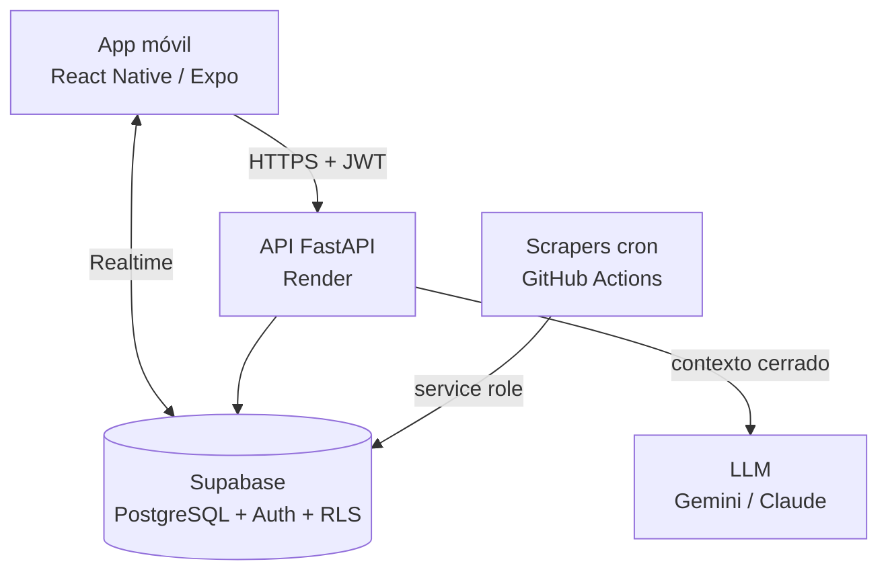

# Arquitectura de software — App de apoyo a cuidadores
**Grupo 7 · GPTI 2026-2 · Responsable: David Boyd (Backend y BD)**
**Estado: propuesta para aprobación del equipo**

---

## 1. Contexto y restricciones que mandan

Toda decisión de abajo se deriva de estas cinco restricciones. Si alguna cambia, la arquitectura se revisa.

| Restricción | Implicancia arquitectónica |
|---|---|
| Presupuesto $0 en desarrollo | Solo servicios con capa gratuita real (Supabase, Render, Gemini/Claude free tier) |
| Un semestre, 5 personas, 1 backend dev | Mínimo de piezas móviles; nada que exija operación 24/7 |
| Datos de salud de personas dependientes | Seguridad no negociable: es dato sensible bajo la Ley 21.719 de protección de datos |
| KPIs comprometidos: resumen <1 min, IA >90% verificable, relevo >60% | La arquitectura debe hacer *medibles* los KPIs, no solo posibles |
| Multiusuario concurrente (red familiar sobre un mismo paciente) | Consistencia y control de acceso a nivel de fila, sincronización casi en tiempo real |

## 2. Atributos de calidad priorizados

En orden — cuando dos choquen, gana el de arriba:

1. **Seguridad de datos** (dato clínico + Ley 21.719)
2. **Simplicidad operable** (un equipo estudiantil debe poder mantenerla)
3. **Performance percibida** (cuidadores con conectividad limitada)
4. **Escalabilidad** (con camino claro, sin sobre-ingeniería hoy)

## 3. Vista general

```
┌─────────────────────────────────────────────────────────────┐
│  CLIENTE · React Native (Expo)                              │
│  UI + SDK Supabase (auth, realtime) + cache local           │
└──────────┬──────────────────────────────┬───────────────────┘
           │ HTTPS + JWT                  │ WebSocket (Realtime)
           ▼                              ▼
┌─────────────────────────┐   ┌───────────────────────────────┐
│  API · FastAPI (Render) │   │  SUPABASE (BaaS)              │
│  - valida JWT           │◄──┤  - PostgreSQL + RLS           │
│  - lógica de negocio    │   │  - Auth (JWT)                 │
│  - orquestación IA      │   │  - Realtime (pub/sub filas)   │
│  - resúmenes médicos    │   │  - Storage (adjuntos, futuro) │
└──────────┬──────────────┘   └───────────────▲───────────────┘
           │ HTTPS                            │ service role (cron)
           ▼                                  │
┌─────────────────────────┐   ┌───────────────┴───────────────┐
│  LLM · Gemini / Claude  │   │  JOBS · GitHub Actions        │
│  (proveedor abstraído)  │   │  scraping MDSF + farmacias    │
└─────────────────────────┘   └───────────────────────────────┘
```

**Tres planos separados**: interactivo (API), reactivo (Realtime directo cliente↔Supabase para que la bitácora se actualice sola entre familiares) y batch (scrapers por cron). Ningún plano bloquea a otro.

## 4. Seguridad de datos (el atributo N°1)

**Defensa en profundidad con tres capas independientes:**

1. **Transporte y sesión.** HTTPS en todo; auth delegada a Supabase Auth (JWT firmado, refresh tokens, hashing de contraseñas fuera de nuestro código — menos superficie propia que atacar).
2. **Autorización en la base, no en el código: Row-Level Security.** Cada tabla tiene políticas que garantizan que un usuario solo ve pacientes de sus grupos de cuidado, con roles `admin / caregiver / viewer`. La API consulta con el token *del usuario*, nunca con clave maestra. Consecuencia defendible: un bug en un endpoint **no puede** filtrar datos de otro paciente — la última línea de defensa no depende de que el código esté correcto.
3. **Mínimo privilegio para lo demás.** La service role key (que salta RLS) vive solo en los jobs de scraping, que escriben tablas públicas de solo lectura (centros, precios) y jamás tocan datos clínicos. Secretos en variables de entorno; `.env` fuera del repo.

**Datos y ley.** La bitácora es dato personal sensible (salud) según la Ley 21.719: se recolecta solo lo necesario (minimización), el titular del grupo (admin) controla quién accede, y el borrado de un paciente cascadea todo su historial (derecho de supresión implementable desde el día uno). El LLM externo recibe la bitácora como contexto pero **nunca almacenamos datos del paciente en el proveedor de IA** — la conversación persiste en nuestra base, no en la de ellos.

## 5. Integración de IA (diseñada para el KPI, no para el demo)

**Patrón: contexto cerrado con trazabilidad** (grounding estricto):

```
pregunta → API arma contexto SOLO con bitácora autorizada (RLS)
        → prompt con instrucción "responde únicamente con esto"
        → respuesta + registro de qué entradas vio (cited_entry_ids)
```

- **El LLM nunca toca la base**: la API decide qué contexto entra. Sin function-calling libre ni SQL generado por el modelo — elimina de raíz la inyección vía prompt y las fugas entre pacientes.
- **Trazabilidad como dato**: cada respuesta guarda las entradas de bitácora usadas. El KPI ">90% verificable" se audita con una consulta, no con fe.
- **Proveedor abstraído** detrás de una interfaz única (`ask_llm`): Gemini free tier por defecto, Claude por variable de entorno. Si un free tier cambia (riesgo declarado en el caso de negocio), migrar cuesta una función, no un rediseño.
- **Voz**: transcripción en el cliente (SDK de Expo / API de speech), el backend recibe texto con `source: "voice"`. El audio crudo no viaja ni se almacena en el MVP — menos costo, menos riesgo, misma funcionalidad.
- **Presupuesto de tokens**: contexto acotado (últimas N entradas / ventana temporal del resumen), respuestas con `max_tokens`. Protege el free tier y la latencia.

## 6. Performance con distintos usuarios

| Riesgo | Mitigación de diseño |
|---|---|
| Bitácoras largas (meses de registros) | Índice `(patient_id, occurred_at desc)` + paginación obligatoria; el feed carga en una consulta indexada |
| Varios familiares escribiendo a la vez | Escrituras append-only en `log_entries` (sin updates concurrentes → sin conflictos de bloqueo); Realtime propaga a los demás |
| Latencia del LLM (2–10 s) | Endpoints IA `async` (FastAPI no bloquea otros requests); UI muestra estado; el resto de la app nunca espera a la IA |
| Free tier de Render "duerme" el servicio (cold start ~30 s) | Lecturas críticas (feed, login) van directo cliente→Supabase; la API concentra lógica de negocio e IA. Cron de keep-alive si molesta en la demo |
| Conectividad móvil pobre (usuarios reales del caso) | Cache local en el cliente + payloads chicos (JSON plano, paginado); Realtime degrada a polling sin romper nada |
| Consultas N+1 | Relaciones resueltas en una consulta (`select` anidado de PostgREST) |

## 7. Escalabilidad: camino declarado, no sobre-ingeniería

La arquitectura del MVP aguanta el piloto (decenas–cientos de usuarios) en capas gratuitas. Lo importante es que **cada salto es incremental, sin rediseño**:

| Etapa | Cuello esperado | Salto (sin cambiar arquitectura) |
|---|---|---|
| Piloto (semestre) | ninguno | — |
| Cientos de usuarios activos | Render free duerme; conexiones a Postgres | Render pago (~USD 7/mes); pooling con pgbouncer (Supabase lo trae) |
| Miles | resúmenes IA síncronos | cola liviana (tabla `jobs` + worker) para resúmenes; caché de resúmenes recientes |
| Producto real | acoplamiento a Supabase | es Postgres estándar: `pg_dump` y migrar a RDS/Cloud SQL; el SDK se reemplaza por SQLAlchemy sin tocar el modelo |

El caso de negocio ya presupuesta la etapa 2 (Supabase Pro + Render en el año 1: ~USD 600), así que el camino de pago está cubierto por el propio plan.

## 8. Decisiones clave y alternativas descartadas

| # | Decisión | Alternativa descartada | Por qué |
|---|---|---|---|
| D1 | Supabase (BaaS) como base + auth | Postgres autoadministrado + auth propia | Auth casera en datos de salud es el riesgo N°1 con un solo backend dev; RLS y Realtime vienen resueltos; salida a Postgres estándar garantizada |
| D2 | RLS en la base | Autorización solo en la API | La API puede tener bugs; la base es la última línea. Con RLS, el peor bug filtra *nada* |
| D3 | Monolito FastAPI | Microservicios / serverless functions | 1 dev backend, 1 semestre: un deploy, un log, una cosa que operar. Microservicios aquí es riesgo sin beneficio |
| D4 | Realtime cliente↔Supabase | WebSockets propios en FastAPI | Mantener websockets con Render free (que duerme) es frágil; Supabase Realtime es gratis y probado |
| D5 | LLM con contexto cerrado | RAG con embeddings / agente con herramientas | La bitácora de un paciente cabe completa en el contexto; embeddings agregan infraestructura sin mejorar el KPI. Revisar solo si las bitácoras crecen a años |
| D6 | Scraping batch desacoplado | Scraping on-demand desde la API | Latencia y fragilidad fuera del camino del usuario; si el scraper se cae, la app ni se entera |

## 9. Riesgos aceptados

- **Dependencia de free tiers** (declarada en el caso de negocio): mitigada con proveedor LLM intercambiable y salida estándar de Postgres.
- **Cold start de Render** en demos: mitigado con lecturas directas a Supabase y keep-alive.
- **RLS mal escrita = falso sentido de seguridad**: mitigación = tests de políticas (usuario A no ve paciente de B) en CI desde la semana 1.

## 10. Primeros pasos

1. [ ] Aprobar este documento con el equipo (especialmente D1–D4 con Juan Ignacio).
2. [ ] Crear proyecto Supabase + correr `db/schema.sql` (esqueleto ya generado).
3. [ ] Tests de RLS en CI (el punto de seguridad se defiende con tests, no con confianza).
4. [ ] Publicar `/docs` (OpenAPI) como contrato con Desarrollo Móvil.
5. [ ] Acordar con IA y Datos la interfaz de los scrapers (tablas destino ya definidas).

## Anexo — Diagrama (Mermaid)


